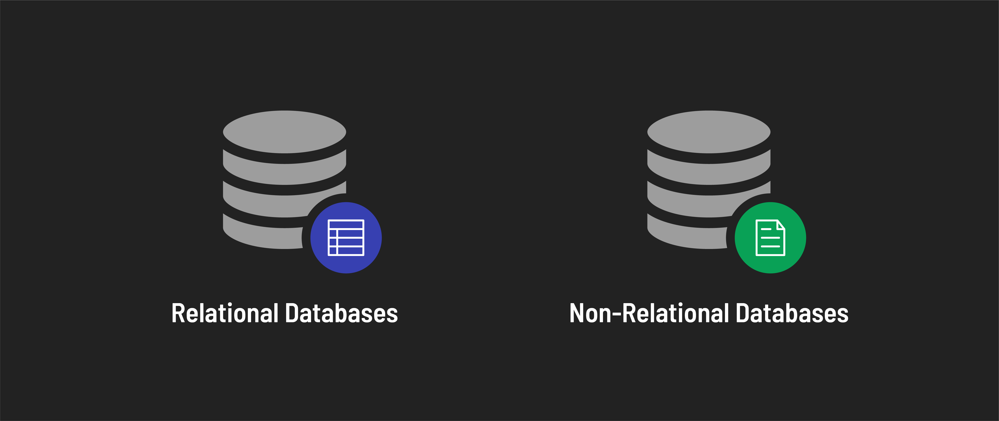

<h1>
  Intro to Databases
  Comparing Relational and Non-Relational Databases
</h1>

**Learning Objective:** This lesson will clarify the fundamental differences between relational and non-relational databases, helping students decide which to use based on specific application requirements.

## Exploring the differences and use cases of different databases

While both relational and non-relational databases serve the purpose of persisting data, they do so using different methods.

### Schema vs. schema-less databases

The core distinction between relational and non-relational databases lies in their approach to structuring data:

**Schema in relational databases**:

- A relational database uses a predefined schema to organize data into tables.
- Each table consists of rows and columns, where columns define the data type and structure.
- This rigid schema ensures consistent data entry and supports complex queries for data.

**Schema-less in non-relational databases**:

- Non-relational databases, like MongoDB, do not require a predefined schema.
- They allow dynamic data storage, supporting various data formats without needing a fixed structure.
- This flexibility is ideal for handling unstructured or semi-structured data and can quickly adapt to changes in application requirements.

### Selecting the right database for your application

The choice between a relational or non-relational database largely depends on an application's specific needs:

**Relational databases for transaction-heavy applications**:

- Relational databases are ideal for financial applications (for example, banking or stock trading) where handling [***database transactions***](https://en.wikipedia.org/wiki/Database_transaction) with accuracy and consistency is paramount.
- These databases struggle with non-uniform data that cannot be neatly organized into structured tables.

**Non-relational databases for unstructured data**:

- These databases are suited for applications dealing with large amounts of diverse data, like social media platforms.
- MongoDB, a popular document-based non-relational database, offers high flexibility. It is a great choice for rapidly changing and evolving data models, as often seen in prototyping stages.
