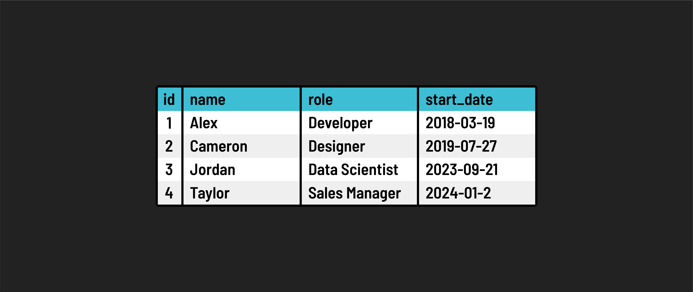

# 

**Learning Objective:** By the end of this lesson, students will understand the basics of relational databases, the role of SQL, and the key components that constitute the structure of a relational database.

## Introduction to relational databases

A relational database is a type of database management system (DBMS) that organizes data into tables, which consist of rows and columns. This structure is based on the principles of the relational model, introduced by E.F. Codd in 1970. In a relational database, data is stored in a structured way to establish relationships between different entities.

### SQL: The language of databases

**[SQL (Structured Query Language)](https://developer.mozilla.org/en-US/docs/Glossary/SQL)**, typically pronounced "sequel" or "Ess-Que-Ell" is the standard programming language for interacting with relational databases. Its syntax is designed to be intuitive, bearing a resemblance to the English language, which makes SQL relatively straightforward to learn and use.

**SQL's functionality includes the ability to:**

- Create, Read, Update, and Delete (CRUD) data within a database.
- Define and manipulate the structure of database tables.
- Manage and control access to the database.

It's important to note that while SQL is largely standardized, there can be slight variations in its implementation across different Relational Database Management Systems (RDBMS). Common RDBMSs like `SQLite` and `PostgreSQL` might differ in terms of the specific SQL commands they support.

### Tables, Rows, and Columns

These are the fundamental structural components of a relational database:

- **Tables**: A table in a relational database is akin to a spreadsheet. It serves as the primary container for data and is organized into rows and columns.

- **Rows**: Each row in a table represents a unique instance or record of the entity being stored. For example, in a table of employees, each row would represent a single employee.

- **Columns**: Columns define the specific attributes or fields of the data entity. Each column in a table specifies the type of data it holds, like a name, date, number, etc.

Example of a Table Structure:

Understanding the relationship between tables, rows, and columns is crucial for working with relational databases. These elements work together to store data in an organized and accessible manner, making relational databases a staple in data management across various industries.
